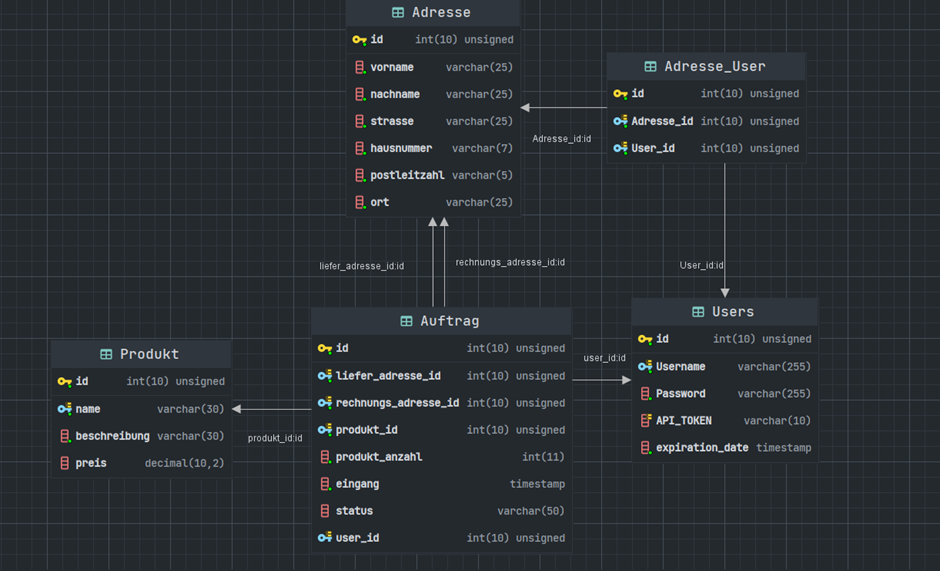

= Carlos Webservice
// TODO Deckblatt
:numbered:
:doctype: book
:source-highlighter: prettify
:lang: de
:data-uri:      // Bilder in der HTML-Datei
:toc:
:toclevels: 5
:toc-title: Inhaltsverzeichnis
:sectnums:
:sectnumlevels: 10
:figure-caption: Abbildung

== Einleitung

=== Motivation

Für die Trainingsfirma der EDV-Schulen soll ein Programm erstellt werden, das Aufträge von Kunden speichert und sie an die Fertigungsstraße weitergibt

Es soll die Verbindung zwischen den Clients und Leitrechner ermöglichen, der Webservice bedient eine Datenbank in der Auftrags-/Produkt informationen gespeichert werden, welche dann von Leitrechnern ausgelesen und bearbeitet werden.

=== Ziele

Es soll eine Effiziente und umfangreiche Schnittstelle entstehen, um alle Anwendungsfälle zu decken, die einen einfachen Umgang ermöglicht und es einem Kunden möglichst einfach macht Aufträge abzugeben.

=== Allgemeines

Die gesamte Bearbeitung des Projekts betrug 5 Monate

|===
2+| Aufgabenverteilung

| Server Logik | gemeinsam
| DB Design | gemeinsam
| SQL Abfragen | gemeinsam
| Routen erstellen |  Simon Weber
| SQL Funktionen |  Flavius Secheli
|===

== Soll-Zustand

=== Funktionalität

==== Use Case Diagram

.Use Case Diagramm (wurde selbst erstellt mit https://app.diagrams.net/[Draw.io])
image::images/UseCase.png[UseCase]

==== Use Case Beschreibung

===== Kurzbeschreibung Auftragsverwaltung

Diese Anwendungsfälle erlauben es dem Nutzer Aufträge anzulegen und dessen Status über eine eindeutige ID abzufragen, die Daten werden dabei aus der Datenbank abgerufen

===== Kurzbeschreibung Login-System

Diese Anwendungsfälle erlauben es dem Nutzer sich ein Konto anzulegen und dieses zu verwalten.
Durch Kontoerstellung oder Login wird ein eindeutiger Token erstellt, der bei jeder Abfrage geprüft wird.

===== Standardverhalten

Es stehen folgende Arten von Aktionen für den Client zur Verfügung

|===
4+|Mögliche Aktionen

|Auftrag Anlegen | Auftrag Status abfragen | Produkt Informationen abrufen | Login-system
|===

In `POST` Requests wird als Content-Type JSON verwendet und in `GET` Request dienen Queryparameter für mögliche Variablen

===== Produkte abrufen

Eine einfache `GET` Anfrage auf `/api/products` gibt eine Liste aller relevanten Informationen aller Produkte zurück. +
Ein Produkt hat folgende Attribute

* id: int
* name: Char
* beschreibung: String
* preis: number

===== Authentifizierung

====== Token

Ein Token ist ein eindeutiger String.
Er wird benutzt, um die wiederholte Passworteingabe bei jedem Aufruf zu verhindern und erlaubt dem Server, die Daten, wie hinterlegte Adressen des Nutzers zu verwenden und auch den Nutzer als Sender zu hinterlegen.

====== Nutzer Anlegen

Eine `Post` Anfrage an  `/api/user/create` mit

* username
* password

Dadurch wird in der Datenbank ein neuer Nutzer angelegt, solange er noch nicht schon existiert. +
Zurückgegeben wird entsprechend ein Token mit dem man sich authentifizieren kann

====== Login

Eine `Post` Anfrage an `/api/user/login/` hat zwei benötigte Parameter und zwei Optionale

* username
* password

* token_duration : int
* new_password

token_duration: Hiermit kann man das Ablaufdatum des Auszustellenden Token verändern +
new_password: Hiermit wird das Passwort abgeändert

===== Auftrag anlegen

Jede Bestellung hat

* Liefer/Rechnungs-adresse
* Ein Produkt
* Anzahl
* Auftragsteller
* Eingangsdatum
* Status

Es gibt zwei Wege die Adressen der Bestellung zu übergeben.

* Die Adressen manuel übergeben +
Es müssen zwei Adressen (Lieferadresse und Rechnungsadresse) nach folgendem Muster angegeben werden. +
Die Rechnungsadresse kann leer gelassen werden, sollte sie gleich der Lieferadresse sein.
Falls das der Fall ist, wird sie kopiert.
** Vorname
** Nachname
** Strasse
** Haus Nummer
** Postleitzahl
** Ort
* gespeicherte Adressen des users via Token verwenden +
Der Token muss gültig sein und der User muss eine Adresse gespeichert haben

Des weiteren werden folgende Parameter benötigt

* Bestellung
** Produkt: Anzahl
* Token

Es können mehrere Produkt-/Anzahlpaare vorkommen welche dann intern auf eigene Bestellungen aufgeteilt werden

Eine `Post` Anfrage an `/api/order/create` erstellt einen neuen Auftrag in der Datenbank

Nach dem Erfolgreichen Prüfen des JSON Objekts wird diese Funktion aufgerufen

[source,JS,options="nowrap"]
----
    let waitForIds = async function (delivery_address, billing_address) {
        return new Promise((resolve, reject) => {
            let ids = [];
            let i = 0
            for (const type in req.body["bestellung"]) {
                con.query('select create_order(?,?,?,?,?,?,?,?,?,?,?,?,?,?,?)', [delivery_address.vorname, delivery_address.nachname, delivery_address.strasse, delivery_address.nr, delivery_address.plz, delivery_address.ort, billing_address.vorname, billing_address.nachname, billing_address.strasse, billing_address.nr, billing_address.plz, billing_address.ort, type, req.body["bestellung"][type], req.body["token"] ? req.body["token"] : "null"],
                (err, result) => {
                    if (err) {
                        // ids.push(-1)
                    } else {
                        ids.push(Object.values(JSON.parse(JSON.stringify(result))[0]).toString())
                    }
                    if (i === Object.values(req.body["bestellung"]).length - 1) {
                        resolve(ids)
                    }
                    i++;
                })
            }
        })
    }
----

In diesem Codeauszug ist ``req.body["bestellung"]`` ein Array aus Produkt-/Anzahlpaaren.
Für jedes dieser wird eine Datenbankabfrage abgesetzt.
Sobald die letzte Abfrage beendet wurde, wird das Promise aufgelöst und das Array der IDs zurückgegeben.

[source,js,options="nowrap"]
----
var res = require("express/lib/response");

    waitForIds(delivery_address, delivery_address).then(value => {
        res.status(200)
        res.send(value)
    })
----

In diesem Codeblock wird `waitForIds` von Oben aufgerufen und sobald sie durchgelaufen ist, also wenn das Promise "resolved" wird, wird eine Antwort an den Anfragenden gesendet, deren Status wird auf 200/OK gesetzt und es werden die IDs übergeben, die die aufgerufene Methode zurückgibt.

===== Auftrag Status abfragen

Eine `GET` Anfrage an `/api/order/status/` mit `order` (Auftragsid : `int`) als `Queryparameter`.

Diese Anfrage liefert ein String mit dem Status zurück.

=== Fehlerbehandlung

Sollte eine Anfrage ohne Probleme durchgelaufen sein wird ein Statuscode 200-OK zurückgegeben

=== Tests

Da die Zeit sehr knapp war, gab es keine Möglichkeit Unittests zu schreiben.

Eine weitere Methode war, alle anderen Gruppenmitglieder auf unserem Live-server arbeiten zu lassen, und alle ihre Probleme zu lösen.

Nach jedem neuen Feature wurde mithilfe von https://chrome.google.com/webstore/detail/advanced-rest-client/hgmloofddffdnphfgcellkdfbfbjeloo[ARC-Client] getestet.
Man hat versucht, sich jegliche Nutzer Aktionen auszudenken und zu prüfen, ob alles fehlerfrei (außer die von uns geworfene Fehlern) läuft.

=== Rahmenbedingungen

==== Server

Die Datenbank und der Webservice werden beide von einem virtuellen Debian 5.10 Server zur Verfügung gestellt

===== Webservice

Der Webservice ist eine node Anwendung auf basis des Express-Frameworks.
Zum Entwickeln wurde er mit https://nodemon.io/[nodemon] gestartet.
Auf dem Server wird die App mit https://pm2.keymetrics.io/[pm2] verwaltet, durch welches eventuelle Skalierung bei Bedarf möglich wäre. +

===== Datenbank

* Für dieses Projekt wird die MariaDB (Version 10.5.15) genutzt
* Die Stammdaten befinden sich in den Tabellen

** Adresse
** Adresse_User
** Auftrag
** Produkt
** Users

.Klassendiagramm (wurde selbst erstellt mit Datagrip)

Die benötigte SQLFunktionen:

* create_order
* create_user
* address_index

Erstellt eine Adresse, falls sie noch nicht vorhanden ist und liefert die Id zurück.

* add_address_to_user

Speichert eine Adresse zu einem User-token.

* address_from_token

Falls eine Adresse zu einem bestimmten User gibt, wird die Id zurückgeliefert.

==== Entwicklung

Das Programm wurde in Windows (10 und 11) geschrieben, wobei alle verwendeten IDEs plattformunabhängig sind.

Als Sprachen wurden Javascript und SQL verwendet

Für den Javascript Teil hat man hauptsächlich https://www.jetbrains.com/webstorm/[Webstorm] genutzt.

Für das Erstellen der Tabellen, https://www.phpmyadmin.net/[phpMyAdmin] und für die SQL-Funktionen https://www.jetbrains.com/datagrip/[Datagrip].

==== Abhängigkeiten

Die Abhängigkeiten der Node Applikation sind:

* node
* nodemon +
Startet node bei Dateiänderung neu um bei der Entwicklung zu helfen
* pm2
* express
** cookie-parser
** debug
** http-errors
** morgan
** pug
* cors +
Es musste cors aktiviert werden, da die Website Probleme hatte auf die API zuzugreifen

=== Probleme im Projekt und Lösungsansätze

==== Javascript

Da Javascript nur auf einem Thread läuft und deshalb in der Sprache asynchrones Ausführen stark verbreitet ist, hatte man öfters Probleme mit Funktionen.
Erwartet war, dass sie einen Wert liefern, dabei war der return Wert aber noch `undefined`.
Gelöst hat man das Problem nach ausgiebiger Recherche mithilfe von `Promises` und `Callbacks`.

Ein weiteres Problem war, dass bei der Konvertierung der Datenbankabfragen zu JSON Objekten, vor jedem Objekt
`RowDataPacket` eingefügt wurde.
Gelöst hat man das mit der Funktion `repairJson(json){...}`.

[source,js]
----
function repairJson(json){
    return JSON.parse(JSON.stringify(json));
}
----

Diese formatiert den eingegeben JSON Objekt zum String und dann wieder zu JSON Objekt.

==== MySQL

Mit der Datenbank gab es auch ein Problem. phpMyAdmin war am Anfang nicht erreichbar und hat Fehler geworfen als man die Seite im Browser aufgerufen hat.
Nach einem Update mit `apt update phpMyAdmin` war der Fehler weg.

== Glossar

|===
|Fachwort |Erklärung

|Promise
|Versprechen immer einen Rückgabewert zurückzugeben

|Callback
|Eine Funktion die einer anderen Funktion übergeben wird und aufgerufen wird, wenn die Hauptfunktion es als richtig sieht, meist nachdem sie beendet wurde.
|===

== Quellen

* https://nodejs.org/en/[node]
* https://www.npmjs.com/[npm]
* http://expressjs.com/[Express]
